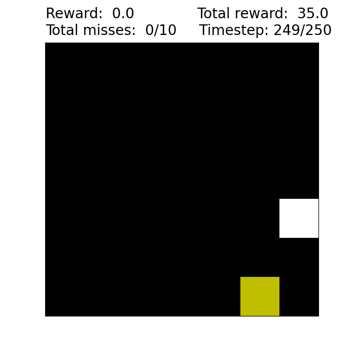

# Policy-based Reinforcement Learning on Catch

Policy-gradient agents that learn to play **Catch** — a paddle at the bottom of
a grid must catch balls dropping from the top. Starting from plain REINFORCE,
the agent is built up through n-step returns, a learned baseline
(advantage actor-critic) and PPO, and then evaluated against variations of the
environment.

The headline result: baseline subtraction contributes more to final performance
than bootstrapping, and sampling several trajectories per update while keeping
only the best-performing ones sharply reduces gradient variance.

Course assignment (Reinforcement Learning, Leiden University, spring 2023).
Full write-up in [`Report_A3.pdf`](Report_A3.pdf).



## Assignment goal

A study of policy-based reinforcement learning: rather than learning values and
acting greedily on them, the agent parameterises the policy itself and improves
it by gradient ascent on expected return. The agent is built up in stages —
plain REINFORCE, then a learned value estimate used both for bootstrapping and
as a baseline, then PPO — and the environment is varied at the end to see which
components actually carry the performance.

## Methods

| Configuration | Return estimate | Critic |
| --- | --- | --- |
| REINFORCE | full-episode Monte Carlo | — |
| REINFORCE + baseline | full-episode Monte Carlo | value baseline |
| Actor-critic | n-step bootstrap | value bootstrap |
| Actor-critic + baseline | n-step bootstrap | value bootstrap + baseline |
| PPO | n-step bootstrap | clipped surrogate objective |

A single `Actor` class serves as both policy and value network — passing
`critic=True` swaps the 3-way softmax head for a scalar linear head. Both are
two hidden layers (64 and 32 units, ReLU) with batch normalisation and dropout,
trained with Adam. Observations are either a two-channel binary pixel grid
(paddle / balls) or a length-3 vector of paddle and lowest-ball coordinates.

Each update samples `minibatch` trajectories, keeps the two with the highest
average reward, and averages their gradients. Once the running reward clears a
threshold the minibatch shrinks, since selection is no longer needed to
stabilise learning.

## Setup

```bash
python -m venv .venv && source .venv/bin/activate
pip install -r requirements.txt
```

See [`requirements.txt`](requirements.txt) for the caveat about newer
TensorFlow versions.

## Usage

`policy.py` is the reference implementation and the entry point:

```bash
python policy.py                    # n-step returns with a baseline (default)
python policy.py --mc               # Monte Carlo returns
python policy.py --mc --baseline    # Monte Carlo with a value baseline
python policy.py --n_step           # n-step returns
python policy.py --n_step --baseline
python policy.py --ppo              # PPO (implies --n_step --baseline)
python policy.py --help
```

Hyperparameters are set at the bottom of `policy.py`:

```python
n_repetitions = 1
n_episodes    = 300
learning_rate = 0.01
rows, columns = 7, 7
obs_type      = "pixel"   # "pixel" or "vector"
max_misses    = 10
max_steps     = 250
n_step        = 5
speed         = 1.0
eta           = 0.001     # entropy-regularisation weight
minibatch     = 4
```

A run writes its policy weights to `w_P_<stamp>.h5`, critic weights to
`w_V_<stamp>.h5`, per-episode rewards to `r_<stamp>.npy` and mean gradients to
`g_<stamp>.npy`, appending a summary line to `data/documentation.txt`.
`continue_run.py` resumes training from a saved pair of weight files.

You can also play Catch yourself:

```bash
python catch.py     # a/s/d to move left/stay/right
```

## Experiments

[`exp.sh`](exp.sh) reproduces the full set of runs behind the report:

```bash
python experiments.py part1                 # the four agent variants, 5 reps each
python experiments.py part2 size            # 7x9, 9x7, 9x9 grids
python experiments.py part2 speed           # drop speeds 0.5, 1.5, 2.0
python experiments.py part2 observation     # vector instead of pixel observations
python experiments.py part2 speed-size      # speed and grid size together
```

Plot saved reward files with `plot.py` (single runs) or `fullplot.py` (means
with 95% confidence bands, as used for the report figures):

```bash
python plot.py data/rewards/r_08_085540.npy
```

## Repository layout

| Path | |
| --- | --- |
| `policy.py` | **reference implementation** — agents, training loop, CLI |
| `catch.py` | the Catch environment; **provided by the course**, see below |
| `Helper.py` | timing/bookkeeping decorators, run logging, plot helper |
| `experiments.py`, `exp.sh` | experiment drivers for the report |
| `continue_run.py` | resume training from saved weights |
| `plot.py`, `fullplot.py`, `merge_rewards.py` | figure generation |
| `data/` | recorded rewards, gradients and weights from the reported runs |
| `plots/` | report figures |
| `REINFORCE.py`, `REINFORCE_semi.py`, `ppo.py` | earlier development iterations, kept for history |
| `dqn.py` | DQN carried over from assignment 2, unrelated to this report |

`experiments.py` and `continue_run.py` import from `REINFORCE_semi.py`, not
`policy.py` — the reported results were produced with that iteration, so the
imports are left pointing at it deliberately. `policy.py` is the same trainer
with the scratch comments removed and the PPO path completed.

## Known issues

These were found while cleaning up the repository and are documented rather
than fixed, so that the committed figures, weights and report stay reproducible
from the code as it stands.

1. **Action labels are permuted.** The training loop samples from
   `ACTION_EFFECTS = (-1, 0, 1)` and passes the *effect* to `env.step()`, but
   `Catch` treats its argument as an *index* into that same tuple. The mapping
   is therefore `-1 → right`, `0 → left`, `1 → idle`. Since this is a bijection
   the agent simply learns the permuted labelling and results are unaffected,
   but the saved `.h5` weights encode it — correcting the mapping would
   invalidate them.
2. **The n-step target is off by one.** `Actor.bootstrap` bootstraps on
   `values[lim - 1]`, the value of the state whose reward is already inside the
   sum, and always discounts by `gamma ** n_step` without shortening the horizon
   or zeroing the bootstrap at a truncated episode end.
3. **PPO is wired up but unvalidated.** The `--ppo` flag was never forwarded to
   the training loop, so no reported result used it. It is forwarded now, but
   the objective has not been re-run or tuned: notably the critic loss term
   added inside the *actor* update is computed from value estimates recorded
   during rollout, so it is constant with respect to the actor's weights and
   contributes no gradient.
4. **`dqn.py` does not import.** It expects helper functions
   (`make_tensor`, `e_greedy`, `softmax`, `linear_anneal`, `convolute`) that
   belonged to the assignment-2 version of `Helper.py`.

## Credits

Group 13 — **Nikolaos-Maximos Bilalis**, **Christos Tsirogiannis**,
**Luca Barbera**.

`catch.py` is the customisable Catch environment written by **Thomas Moerland**
(Leiden University, 2022), extended from the Catch environment in
[Behaviour Suite for RL](https://arxiv.org/pdf/1908.03568.pdf). It is included
unmodified as course-provided material; everything else in this repository is
our own work.
